# Tab5-Launchpad

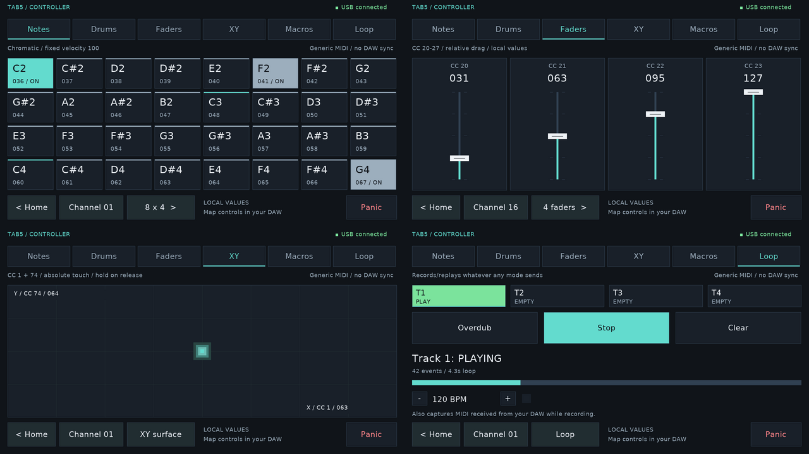

A dedicated firmware for the [M5Stack Tab5](https://docs.m5stack.com/en/core/Tab5)
(ESP32-P4) that turns its touchscreen into a class-compliant USB-MIDI grid
controller — six playing modes, live value readouts, and a flat,
professional UI, with zero DAW-specific lock-in: it's generic MIDI, so it
works with whatever you already use (map it in your DAW's own MIDI-learn,
the same way you'd map any controller).

All images on this page are real renders of the actual firmware code — the
project ships a native Linux preview tool (`tools/build-launchpad-preview.sh`)
that links the real rendering source against a software framebuffer, so
these aren't mockups.

## Features

- **Six modes**, one grid: **Notes** (chromatic, 3 layout sizes), **Drums**
  (GM percussion map, auto-selects MIDI channel 10), **Faders** (CC20-27,
  relative touch drag, live value readout), **XY** (CC1 + CC74, a soft
  glowing touch point, absolute position), **Macros** (CC102-117, 16 relative
  rotary knobs), **Looper** (4-track, records/replays whatever you play in
  any mode, per-track overdub, visual BPM metronome, can also capture MIDI
  from a connected host — see below).
- **Every control shows its real value and CC/note assignment on screen** —
  no memorizing a mapping, no guessing what a fader is currently at.
- **Large, dedicated channel picker** (not a cramped always-on strip) — 16
  full-size buttons, one tap to switch.
- **Panic button** — Sustain Off, All Notes Off, All Sound Off, across every
  channel actually used this session, with send-failure feedback.
- **Honest connection state** — the firmware only ever claims what it
  actually knows (USB enumerated vs. not), never implies a DAW is listening
  just because the OS sees the device.
- **Real double-buffered, vsync-synced rendering** — no tearing, every
  frame fully repainted.
- **Class-compliant USB-MIDI device**, always on from boot. Plug in, your
  DAW/synth/whatever sees a standard MIDI input — no driver, no DAW-specific
  plugin.

## How to use

### Home

Boots to a small home screen: open the controller, or check Settings /
Diagnostics.

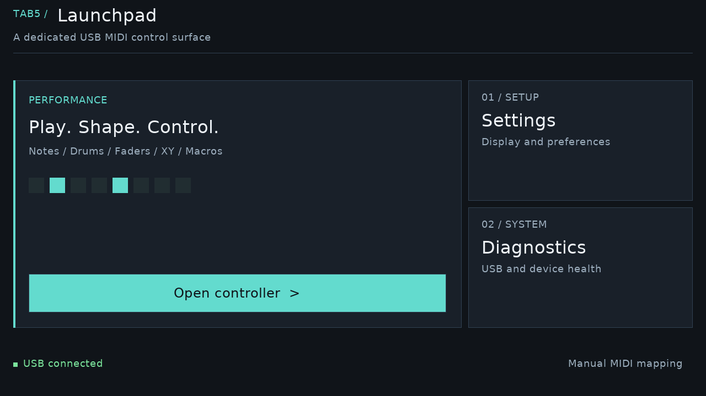

### Notes

Tap pads to play. The footer's dimension button cycles grid size (8x4 /
8x2 / 4x4); the channel button opens the full-screen picker; Panic clears
stuck notes instantly.

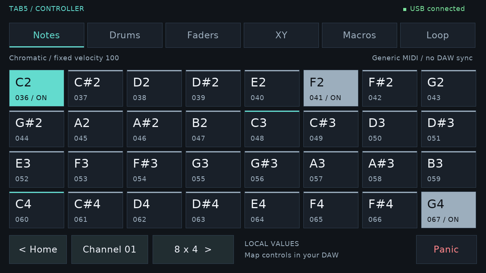

### Drums

Fixed 4x4 GM percussion layout. Switching into this mode auto-selects MIDI
channel 10 — the convention essentially every GM/GS/XG-aware synth and DAW
expects for drums — still overridable from the channel picker afterward.

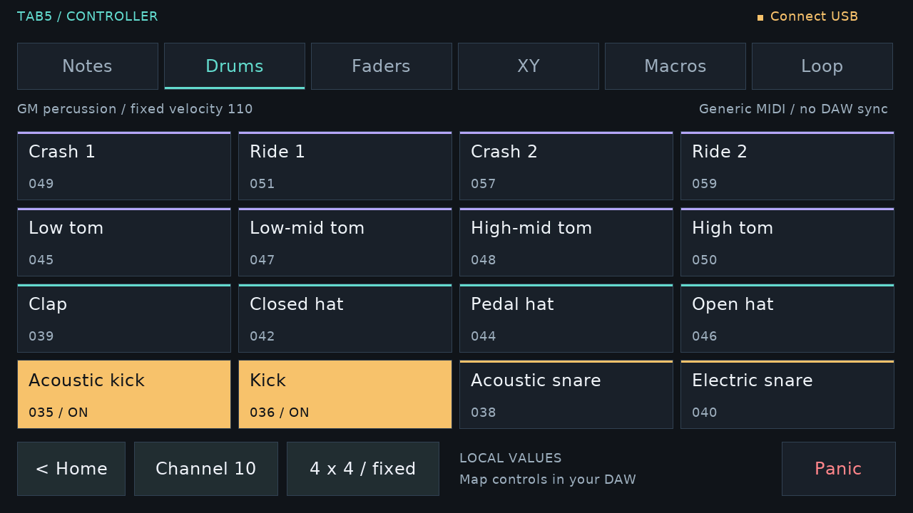

### Faders

Four real touch faders (CC20-27 depending on variant). Press anywhere in a
column to grab it, drag to change the value — the fader won't jump just
because you touched it.

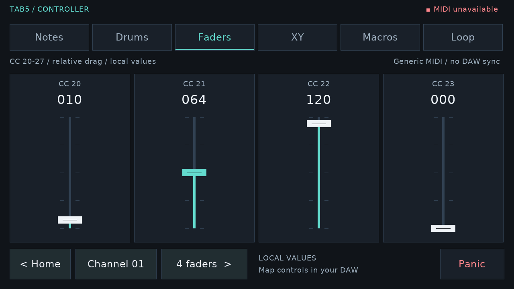

### XY

The whole pad is one continuous surface: X → CC1 (mod wheel), Y → CC74
(filter cutoff/brightness) — both conventional, DAW/synth-recognized CC
assignments. A soft glow tracks your touch instead of a hard crosshair.

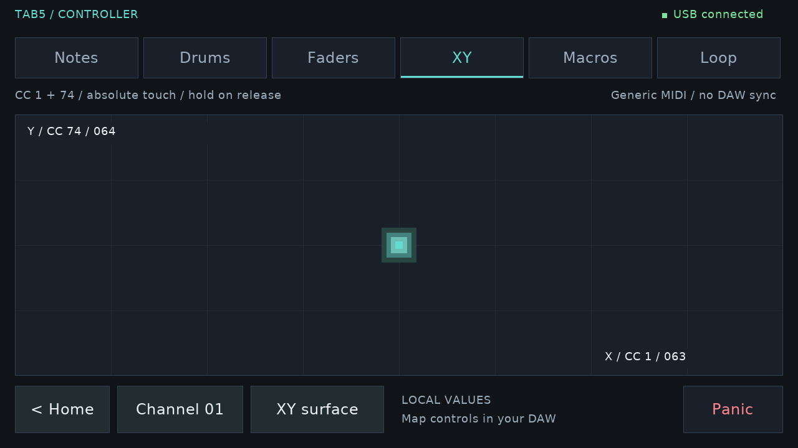

### Macros

Up to 16 rotary knobs (CC102-117). Press and drag **vertically** to turn —
relative drag, not absolute angle, since a flat touchscreen has no
detents to make angle-based turning reliable.

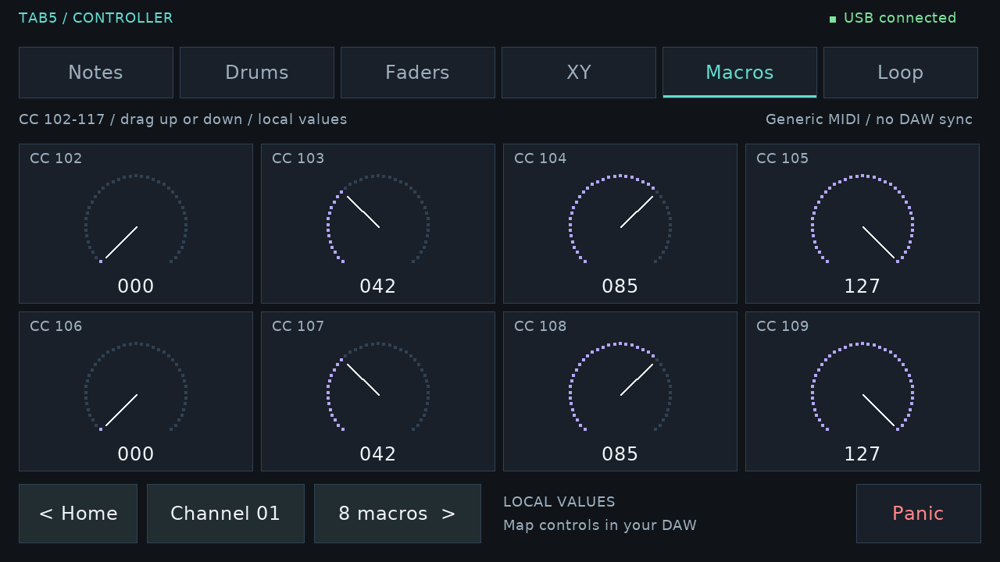

### Looper

**4 independent tracks.** Tap a track button (T1-T4) to select which one
Record/Play/Clear target — the other three keep doing whatever they were
already doing (playing, recording, paused) regardless of which one is
selected, so you can layer tracks: record a part on track 1, let it loop,
select track 2, record over the top of it, and so on.

Tap **Record** to start capturing on the selected track, tap it again to
close the loop at whatever length you just played (it starts looping
immediately). Switch to another mode and keep playing — the loop keeps
going underneath. Tap Record again while it's playing to **overdub**
(layers new material into that track without erasing it); tap again to
stop adding. **Play/Stop** pauses and resumes from exactly where it left
off, not from the start. **Clear** wipes the selected track only.

Each track records whatever you play locally in *any* mode, **and** MIDI
received from a connected host/DAW while that track is armed — so you can
loop something your DAW sends back to the device, not just what you play
on the pads.

A BPM readout with +/- buttons and a pulsing beat indicator give a visual
tempo reference — purely a feel aid, it does not quantize or snap
recording/playback to a grid.

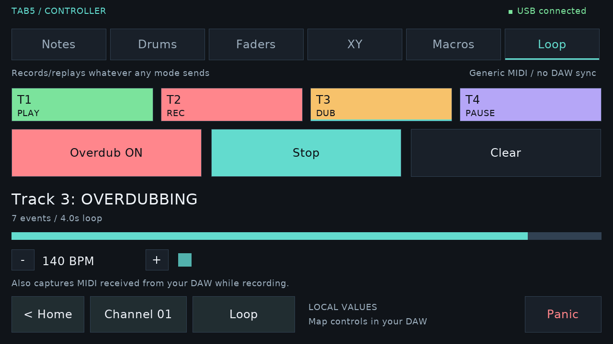

### Channel picker

A dedicated full-screen picker (not a cramped strip) — large, legible
touch targets for all 16 MIDI channels.

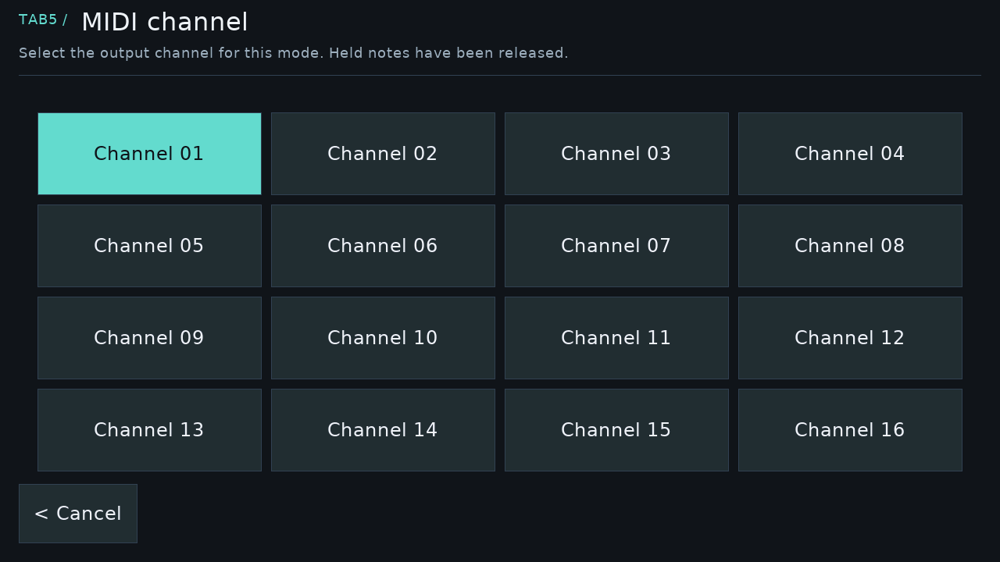

### Settings

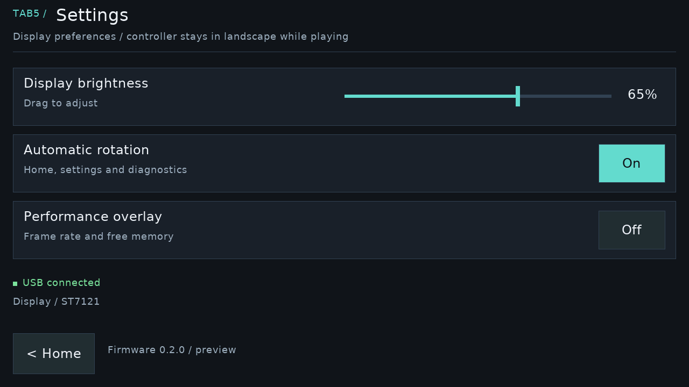

### Diagnostics

Live hardware/USB health — chip, memory, battery, SD, panel, and detected
peripherals.

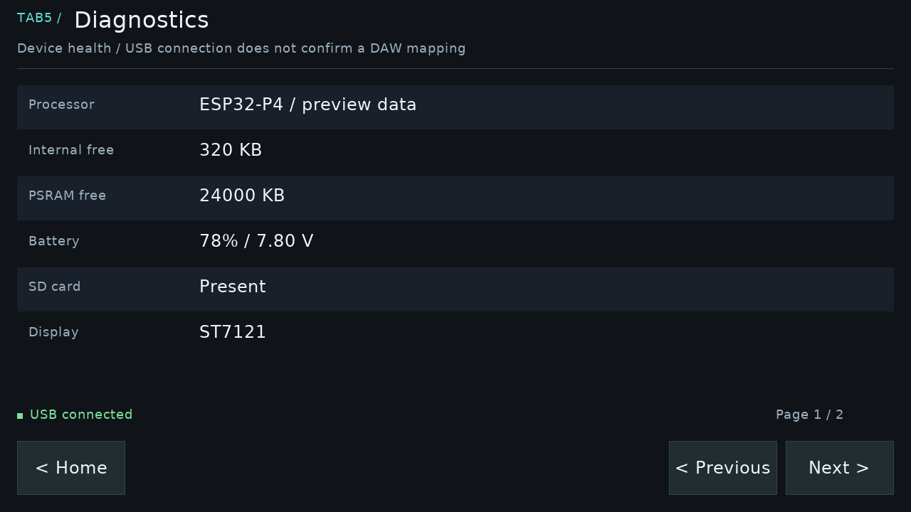

## MIDI mapping reference

Exact note/CC numbers, value formulas, and per-mode variant tables:
[`docs/midi-mapping.md`](docs/midi-mapping.md).

| Mode | Message | Notes |
|---|---|---|
| Notes | Note On/Off | Fixed velocity 100 (no pressure sensing on this touch panel) |
| Drums | Note On/Off | GM percussion map, fixed velocity 110, channel 10 by default |
| Faders | CC 20-27 | Continuous, relative drag |
| XY | CC 1 + CC 74 | Absolute touch position, holds last value on release |
| Macros | CC 102-117 | Relative vertical drag |
| Looper | (replays recorded messages) | Not its own message type — re-sends whatever was captured, locally or from the host, into the selected track |

MIDI channel is set entirely by the device (via the channel picker) — the
host never negotiates or assigns it; it just listens on whichever channel
its MIDI input is pointed at. 16 channels is a hard MIDI 1.0 protocol
limit, not a firmware restriction.

## Building

Stock ESP-IDF project (tested against 5.5.4):

```sh
idf.py build
idf.py -p /dev/ttyACM0 flash monitor
```

Requires a real ESP-IDF 5.5.4 install (`. $IDF_PATH/export.sh` before the
commands above) — this is a stock IDF project, nothing project-specific
needed beyond that. Known gap worth knowing about: some sandboxed/offline
setups fetch an `esptool` that predates ESP32-P4 support; if
`elf2image`/flashing fails with `invalid choice: 'esp32p4'`, you need an
esptool ≥ 5.x ahead of it on `PATH`.

Iterate on the screen's visuals without hardware at all:

```sh
./tools/build-launchpad-preview.sh   # writes real rendered frames to launchpad-preview/
```

A `perf` command is also available over the serial console (any terminal
at 115200 baud) — calls the real draw+present path directly per mode,
unthrottled, and reports timing. Useful if you're chasing a performance
question on your own hardware.

## Architecture notes

- `main/launchpad_modes.c/.h` — pure pad/CC-index → MIDI-message mapping,
  no platform dependency at all.
- `main/launchpad_controller.c/.h` — portable touch-ownership, note
  lifecycle, per-mode channel/layout recall, panic, transport-error state,
  and the Looper's 4-track recording/playback engine. Also platform-free,
  unit-testable natively.
- `main/launchpad_grid.c/.h` + `main/studio_ui.c/.h` — rendering and
  hit-testing, built on antialiased proportional type instead of a bitmap
  font. Every screen does a full repaint every frame it presents — required
  by the real double-buffered display pipeline (`main/display.c`); a
  partial/dirty-region redraw would desync the two alternating hardware
  framebuffers. Text renders via a composed-glyph blit (`su_text()` →
  `sgfx_blit()` → `display.c`'s `set_window`/`write_pixels`), not one fill
  call per antialiasing run.
- `main/launchpad_app.c` — the one ESP-IDF-specific file: touch polling,
  frame pacing, host MIDI receive polling (feeds the Looper's host-capture
  path), wiring the portable controller to real hardware.
- `main/usb_midi_device.c/.h` — always-on class-compliant USB-MIDI device
  (TinyUSB), no host mode of any kind.
- `lib/SIC`, `lib/SGFX`, `lib/konsole` — vendored hardware-abstraction,
  graphics, and console libraries (board bring-up, MIPI-DSI panel driving,
  serial CLI).
